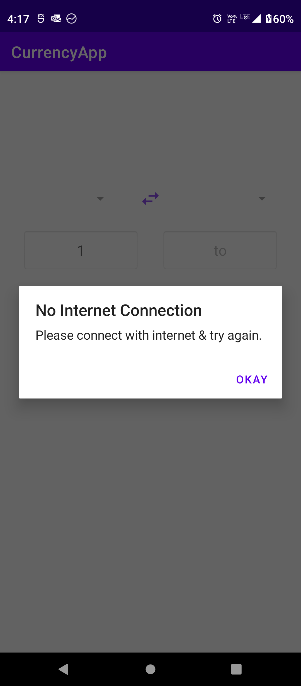

# CurrencyApp
Currency app is designed to helps customers to hand different currency conversions.

 To complete this assignment I was more focused at architecture & flow of the app & less at UI(design).

- **Currency Conversion screen:**
    * Use can select From & To currency dropdowns show all available currencies.
    * User can enter input either in from or to edittext (default text for from edittext is 1).
    * Given user input is converted into expected currency.
    * User can swap the currencies from swap button
  
- **Historic Currency Data screen:** 
    * User can see historic data for last 3 days for selection from previous screen.
    * User can see historic data in bar chart form last 3 days.
    

For this project I have used:

- **Latest version** - Android Studio Dolphin

- **Modular** - The app is broken into modules of features and libraries which can be combined to build instant-apps, complete apps or lite version of apps.

- **MVVM architecture** - Using the lifecycle aware viewmodels, the view observes changes from viewmodel.

- **Kotlin** - This app is completely written in Kotlin.

- **Android Architecture Components** - Lifecycle awareness has been achieved using a combination of Statemaps, ViewModels, Room database, Navigation component, Hilt, View binding, Junit.

- **Screen compatibility** - This app is compatible up-to 10 inch screen size. 

- **Screen Orientation**  - Handled the portrait & landscape mode & persistence of onConfigurationChanges.

# Screenshots:
 

 
  

# Libraries used

* [Android Support Libraries](https://developer.android.com/topic/libraries/support-library/index.html)
* [Retrofit](http://square.github.io/retrofit/)
* [OkHttp](http://square.github.io/okhttp/)
* [Room](https://developer.android.com/topic/libraries/architecture/room.html)
* [ViewModel](https://developer.android.com/topic/libraries/architecture/viewmodel.html)
* [LiveData](https://developer.android.com/topic/libraries/architecture/livedata.html)
* [Navigation](https://developer.android.com/guide/navigation/navigation-getting-started)
* [MPChart](https://github.com/PhilJay/MPAndroidChart)
* [DaggerHilt](https://dagger.dev/hilt/)
* [JUnit](https://developer.android.com/training/testing/local-tests)
* [JUnit]

